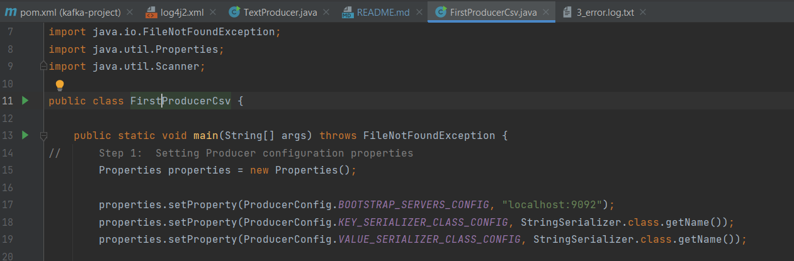
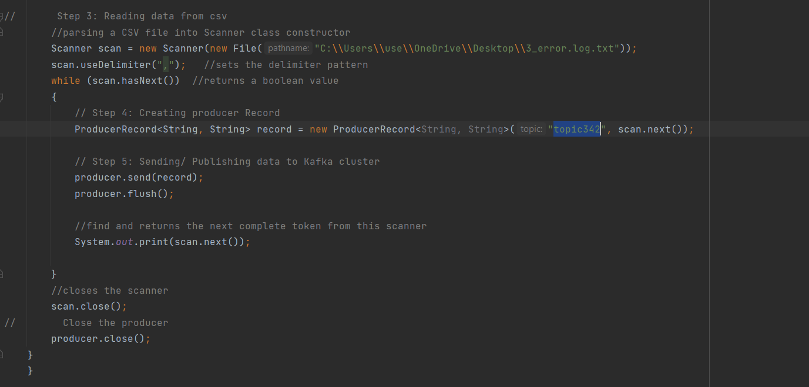
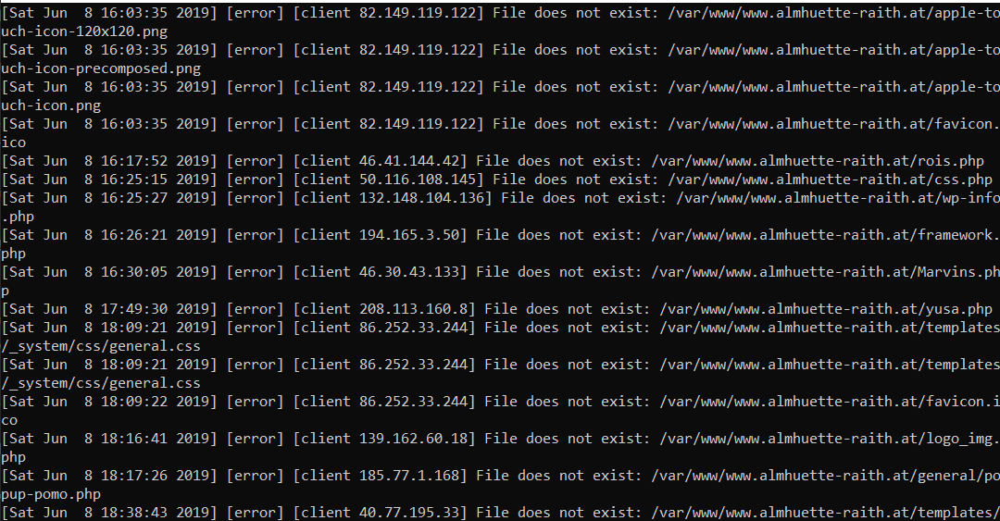
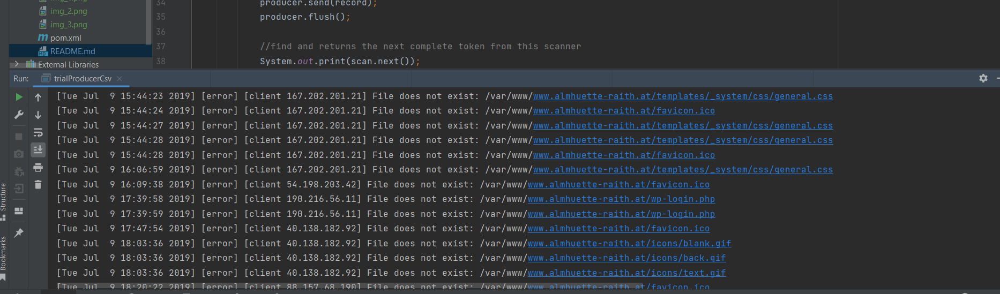

# Apache-kafka-Reading-from-CSV-file

**Creating Kafka Producer**

Basically, there are four steps to create a java producer:

1. Create producer properties
2. Create the producer
3. Create a producer record
4. Send the data.

**Creating Producer Properties**

Apache Kafka offers various Kafka Properties which are used for creating a producer. To know about each property, visit the official site of Apache, i.e., 'https://kafka.apache.org'. Move to Kafka>Documentations>Configurations>Producer Configs

There the users can know about all the producer properties offered by Apache Kafka. Here, we will discuss the required properties, such as:

1. bootstrap.servers: It is a list of the port pairs which are used for establishing an initial connection to the Kafka cluster. The users can use the bootstrap servers only for making an initial connection only. This server is present in the host:port, host:port,... form.
2. key.serializer: It is a type of Serializer class of the key which is used to implement the 'org.apache.kafka.common.serialization.Serializer' interface.
3. value.serializer: It is a type of Serializer class which implements the 'org.apache.kafka.common.serialization.Serializer' interface.

**Creating the Producer**

To create a Kafka producer, we just need to create an object of KafkaProducer.

The object of KafkaProducer can be created as:

_KafkaProducer<String,String> producer = new KafkaProducer<String, String>(properties);_  

Here, 'producer' is the name of the producer we have chosen. The user can choose accordingly.

**Creating the Producer Record**

In order to send the data to Kafka, the user need to create a ProducerRecord. It is because all the producers lie inside a producer record. Here, the producer specifies the topic name as well as the message which is to be delivered to Kafka.

**A ProducerRecord can be created as:**

_ProducerRecord<String, String> record=new ProducerRecord<String, String>("topic342", "Hye Kafka");_  
Here, 'record' is the name chosen for creating the producer record, 'topic342' is the topic name, and 'Hye Kafka' is the message. You can choose accordingly.

**N/B:** for our case here wea are going to create a Scanner then introduce while loop to read through our file.

**Sending the data**
Now, the user is ready to send the data to Kafka. The producer just needs to invoke the object of the ProducerRecord as:

_producer.send(record);_  

To know the output of the above codes, open the **'kafka-console-consumer'** on the CLI using the command:

'_kafka-console-consumer --bootstrap-server 127.0.0.1:9092 --topic topic342 --group app'_

The data produced by a producer is asynchronous. Therefore, two additional functions, i.e., _flush()_ and _close()_ are required (as seen in the above snapshot).
The **flush()** will force all the data to get produced and _close()_ stops the producer. 
If these functions are not executed, data will never be sent to the Kafka, and the consumer will not be able to read it.

The below shows the output of the code on the consumer console as:

Reference from: https://www.javatpoint.com/creating-kafka-producer-in-java
